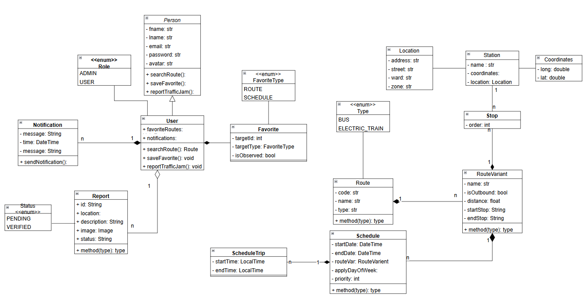
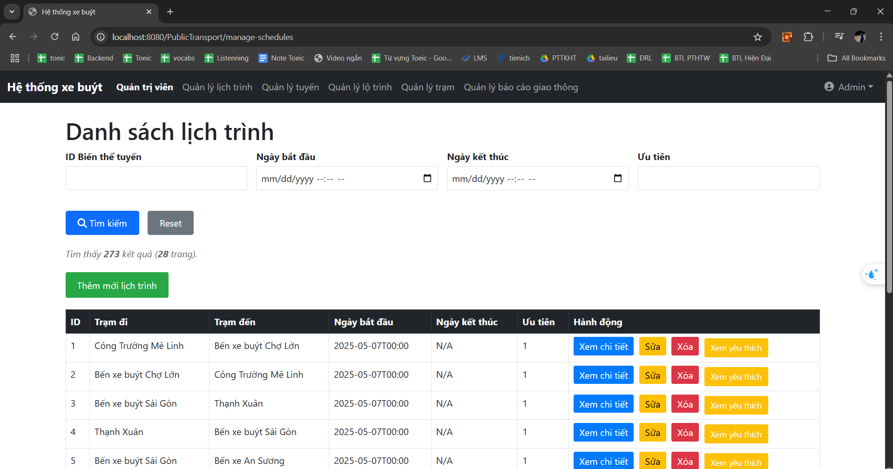
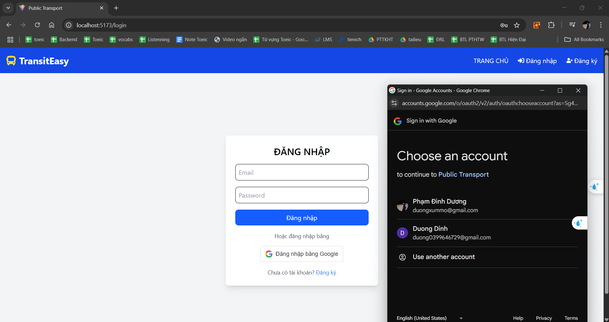
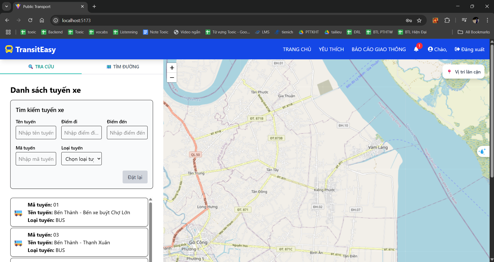
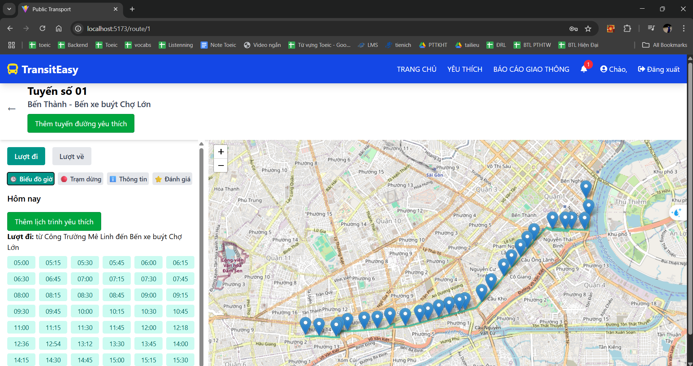
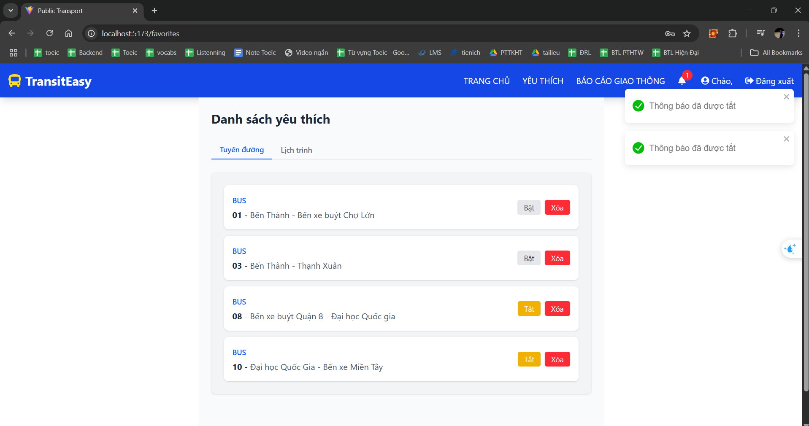
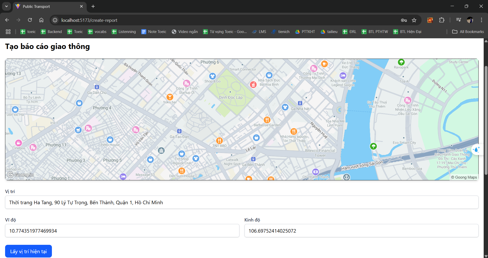
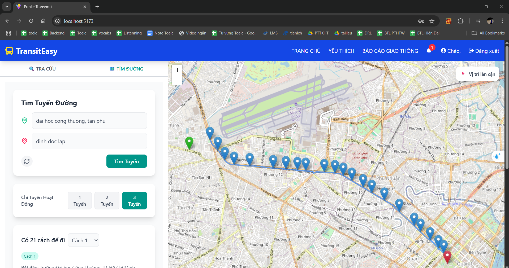

# PUBLIC-TRANSPORT-SYSTEM

- [Tổng quan](#overview)
- [Công nghệ](#Techical)
- [Tính năng](#features)
- [Sơ đồ lớp](#diagrams)
- [Kết quả](#results)
- [Đóng góp](#contributors)

## Overview
Đề tài "Hệ thống giao thông công cộng" hướng đến xây dựng một ứng dụng thông minh hỗ trợ người dân trong việc tra cứu thông tin lịch trình, tuyến đường và tìm kiếm lộ trình tối ưu của các phương tiện giao thông công cộng như xe buýt, tàu điện,... Ứng dụng cho phép người dùng đăng ký tài khoản với avatar, phân vai trò rõ ràng giữa người dân và quản trị viên. Quản trị viên có thể quản lý toàn bộ hệ thống tuyến đường, lịch trình, thời gian khởi hành và đến nơi của các phương tiện. Người dùng có thể tìm kiếm lộ trình di chuyển phù hợp theo điểm đi và điểm đến, được hỗ trợ bằng bản đồ trực quan, đồng thời có thể lưu lại lịch trình yêu thích và nhận thông báo tùy chỉnh khi có thay đổi. Ngoài ra, ứng dụng còn hướng tới việc cập nhật thông tin giao thông theo thời gian thực như tình trạng kẹt xe, sự cố, vị trí phương tiện, và cho phép người dùng chủ động báo cáo các vấn đề thực tế kèm hình ảnh minh họa. Đây là một giải pháp công nghệ hiện đại giúp nâng cao trải nghiệm đi lại, tối ưu hóa thời gian di chuyển và góp phần phát triển hệ thống giao thông công cộng thông minh, thân thiện với người dùng.

## Techical
- **Frontend**: ReactJS
- **Backend**:  SpringMVC
- **Cơ sở dữ liệu**: MySQL
- **Xác thực**: JWT
- **Thông báo**: Email (SMTP)
---

## Features

### 🔐 Xác thực người dùng
- Đăng ký tài khoản với avatar và lựa chọn vai trò (người dân hoặc quản trị viên).
- Đăng nhập, đăng xuất và quản lý phiên làm việc.

### 🗺️ Tìm kiếm và Định tuyến
- Tìm kiếm tuyến đường dựa trên điểm đi và điểm đến.
- Tính toán lộ trình tối ưu theo thời gian, khoảng cách và số lần chuyển tuyến.
- Hiển thị lộ trình chi tiết trên bản đồ kèm các trạm dừng.

### 🚌 Quản lý lịch trình và tuyến đường (dành cho quản trị viên)
- Thêm/Sửa/Xóa lịch trình của các phương tiện giao thông công cộng như xe buýt, tàu điện,...
- Quản lý các tuyến đường: thêm mới, chỉnh sửa, xoá tuyến và trạm dừng.
- Cập nhật thời gian khởi hành và đến nơi cho từng phương tiện.

### ⭐ Cá nhân hóa người dùng
- Lưu lại các tuyến đường và lịch trình yêu thích.
- Thiết lập và nhận thông báo tùy chỉnh về lịch trình và tuyến đường quan tâm.

### 🔔 Cập nhật thời gian thực
- Hiển thị vị trí phương tiện, tình trạng kẹt xe, sự cố giao thông theo thời gian thực.
- Cho phép người dùng báo cáo kẹt xe hoặc sự cố kèm hình ảnh minh họa.

### 🧭 Giao diện thân thiện
- Thiết kế trực quan, dễ sử dụng với bản đồ tương tác và hiển thị thông tin rõ ràng.
- Hỗ trợ cả web và thiết bị di động (nếu áp dụng).

## Diagrams
### Sơ đồ lớp

## Results
## Quản trị viên
<h1 style="text-align: center; margin-bottom: 10px; margin-top:40px;"><i>Quản lý lịch trình và tuyến đường</i></h1>

<h1 style="text-align: center; margin-bottom: 10px;  margin-top:40px;"><i>Duyệt báo cáo giao thông</i></h1>

## Người dùng
<h1 style="text-align: center; margin-bottom: 10px;  margin-top:40px;"><i>Đăng nhập với Google</i></h1>

<h1 style="text-align: center; margin-bottom: 10px;  margin-top:40px;"><i>Giao diện chính của hệ thống</i></h1>

<h1 style="text-align: center; margin-bottom: 10px;  margin-top:40px;"><i>Tra cứu tuyến đường</i></h1>

<h1 style="text-align: center; margin-bottom: 10px;  margin-top:40px;"><i>Thêm lịch trình yêu thích</i></h1>

<h1 style="text-align: center; margin-bottom: 10px;  margin-top:40px;"><i>Báo cáo giao thông</i></h1>

<h1 style="text-align: center; margin-bottom: 10px;  margin-top:40px;"><i>Tra cứu tuyến đường(bao gôm nối tuyến)</i></h1>

## Contributors
- Phạm Đình Dương
- Nguyễn Quang Huy